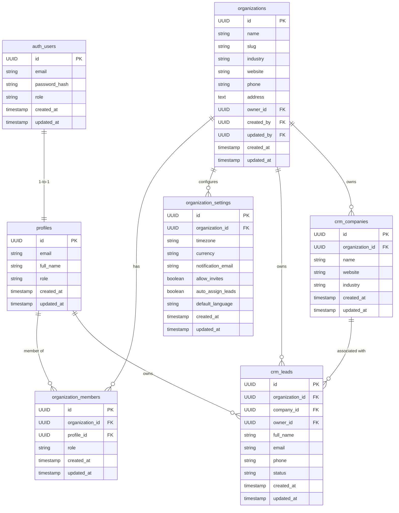

# Sprint 002 Plan

## 1. Sprint Objective

Deliver a stable, tenant-aware authentication and organization foundation with enforced RBAC and server-side Supabase integration. The goal is to move from a scaffolded prototype to a production-ready foundation for multi-tenant access control and protected workspace routes.

## 2. Business Value

- Enables secure onboarding of organizations and users.
- Provides the first true tenant boundary for the product.
- Makes dashboard, CRM, leads, and organization pages safe to use in real multi-tenant deployments.
- Reduces security risk by moving auth enforcement from UI-only checks to server-side route protection.
- Establishes a clear foundation for future CRM, automation, analytics, and AI modules.

## 3. Technical Design

### Focus

Sprint 002 will implement:
- Auth flow stabilization including signup, signin, logout, and password reset.
- Organization creation and membership modeling.
- RBAC enforcement with organization-scoped roles.
- Supabase schema alignment for auth, organizations, members, settings, and CRM tables used by the app.
- API route or server action layer for core auth/org operations.
- App Router route protection for private workspace pages.

### Architecture

- Root Next.js app remains the primary application.
- `lib/supabase/client.ts` and `lib/supabase/server.ts` provide shared Supabase clients.
- `services/auth.ts` and `services/organization.ts` become the canonical backend service interfaces.
- `lib/rbac.ts` centralizes permission checks.
- New API routes or server actions wrap Supabase operations and run server-side.
- Private pages use server-side session validation and redirect when unauthenticated.

## 4. Database Schema

### Required tables

- `organizations`
- `profiles`
- `organization_members`
- `organization_settings`
- `crm_leads`
- `crm_companies`
- `crm_contacts`
- `crm_deals`
- `crm_pipelines`
- `crm_tasks`
- `crm_notes`
- `crm_activity`
- `businesses`
- `notifications`

### Core schema for Sprint 002

- `profiles`
  - `id UUID PRIMARY KEY REFERENCES auth.users(id)`
  - `email VARCHAR(255) UNIQUE NOT NULL`
  - `full_name VARCHAR(255)`
  - `role VARCHAR(50)`
  - `created_at TIMESTAMP WITH TIME ZONE DEFAULT CURRENT_TIMESTAMP`
  - `updated_at TIMESTAMP WITH TIME ZONE DEFAULT CURRENT_TIMESTAMP`

- `organizations`
  - `id UUID PRIMARY KEY DEFAULT gen_random_uuid()`
  - `name VARCHAR(255) NOT NULL`
  - `slug VARCHAR(255) UNIQUE NOT NULL`
  - `industry VARCHAR(100)`
  - `website VARCHAR(255)`
  - `phone VARCHAR(50)`
  - `address TEXT`
  - `owner_id UUID REFERENCES profiles(id) ON DELETE SET NULL`
  - `created_by UUID REFERENCES profiles(id)`
  - `updated_by UUID REFERENCES profiles(id)`
  - `created_at TIMESTAMP WITH TIME ZONE DEFAULT CURRENT_TIMESTAMP`
  - `updated_at TIMESTAMP WITH TIME ZONE DEFAULT CURRENT_TIMESTAMP`

- `organization_members`
  - `id UUID PRIMARY KEY DEFAULT gen_random_uuid()`
  - `organization_id UUID REFERENCES organizations(id) ON DELETE CASCADE`
  - `profile_id UUID REFERENCES profiles(id) ON DELETE CASCADE`
  - `role VARCHAR(50) NOT NULL`
  - `created_at TIMESTAMP WITH TIME ZONE DEFAULT CURRENT_TIMESTAMP`
  - `updated_at TIMESTAMP WITH TIME ZONE DEFAULT CURRENT_TIMESTAMP`

- `organization_settings`
  - `id UUID PRIMARY KEY DEFAULT gen_random_uuid()`
  - `organization_id UUID REFERENCES organizations(id) ON DELETE CASCADE`
  - `timezone VARCHAR(100)`
  - `currency VARCHAR(10)`
  - `notification_email VARCHAR(255)`
  - `allow_invites BOOLEAN DEFAULT TRUE`
  - `auto_assign_leads BOOLEAN DEFAULT FALSE`
  - `default_language VARCHAR(10) DEFAULT 'en'`
  - `created_at TIMESTAMP WITH TIME ZONE DEFAULT CURRENT_TIMESTAMP`
  - `updated_at TIMESTAMP WITH TIME ZONE DEFAULT CURRENT_TIMESTAMP`

- `crm_leads`
  - `id UUID PRIMARY KEY DEFAULT gen_random_uuid()`
  - `organization_id UUID REFERENCES organizations(id) ON DELETE CASCADE`
  - `company_id UUID REFERENCES crm_companies(id) ON DELETE SET NULL`
  - `owner_id UUID REFERENCES profiles(id) ON DELETE SET NULL`
  - `full_name VARCHAR(255)`
  - `email VARCHAR(255)`
  - `phone VARCHAR(50)`
  - `status VARCHAR(50)`
  - `created_at TIMESTAMP WITH TIME ZONE DEFAULT CURRENT_TIMESTAMP`
  - `updated_at TIMESTAMP WITH TIME ZONE DEFAULT CURRENT_TIMESTAMP`

- `crm_companies`
  - `id UUID PRIMARY KEY DEFAULT gen_random_uuid()`
  - `organization_id UUID REFERENCES organizations(id) ON DELETE CASCADE`
  - `name VARCHAR(255)`
  - `website VARCHAR(255)`
  - `industry VARCHAR(100)`
  - `created_at TIMESTAMP WITH TIME ZONE DEFAULT CURRENT_TIMESTAMP`
  - `updated_at TIMESTAMP WITH TIME ZONE DEFAULT CURRENT_TIMESTAMP`

### Notes

Sprint 002 will align the migration files with actual app needs; full CRM tables are defined now but may remain stubbed until later sprints.

## 5. ER Diagram (Mermaid)



## 6. API Endpoints

### Auth

- `POST /api/auth/signin`
- `POST /api/auth/signup`
- `POST /api/auth/password-reset`
- `POST /api/auth/password-update`
- `POST /api/auth/logout`
- `GET /api/auth/session`

### Organizations

- `GET /api/organizations`
- `GET /api/organizations/:organizationId`
- `POST /api/organizations`
- `PATCH /api/organizations/:organizationId`
- `DELETE /api/organizations/:organizationId`
- `GET /api/organizations/:organizationId/settings`
- `POST /api/organizations/:organizationId/settings`
- `GET /api/organizations/:organizationId/members`
- `POST /api/organizations/:organizationId/members/invite`
- `PATCH /api/organizations/members/:memberId`
- `DELETE /api/organizations/members/:memberId`

### CRM (stubs)

- `GET /api/crm/leads`
- `POST /api/crm/leads`
- `GET /api/crm/companies`
- `POST /api/crm/companies`
- `GET /api/crm/tasks`
- `POST /api/crm/tasks`
- `GET /api/crm/activity`

## 7. Folder Structure

```
app/
  layout.tsx
  page.tsx
  login/page.tsx
  signup/page.tsx
  forgot-password/page.tsx
  reset-password/page.tsx
  dashboard/layout.tsx
  dashboard/page.tsx
  crm/page.tsx
  leads/page.tsx
  organizations/page.tsx
  organizations/members/page.tsx
  organizations/settings/page.tsx
lib/
  supabase/
    client.ts
    server.ts
  rbac.ts
  validators/
    auth.ts
services/
  auth.ts
  organization.ts
  crm.ts
  notifications.ts
components/
  auth/AuthCard.tsx
  layout/dashboard-shell.tsx
  layout/page-header.tsx
  layout/widget-card.tsx
  crm/crm-forms.tsx
supabase/
  migrations/
  seed/
types.ts
PROJECT_STATUS.md
SPRINT-002-PLAN.md
```

## 8. Components

### Existing

- `AuthCard`
- `SubmitButton`
- `DashboardShell`
- `PageHeader`
- `WidgetCard`
- CRM forms in `components/crm/crm-forms.tsx`

### New or Updated

- `components/layout/ProtectedPageLayout.tsx` (optional, for common auth guard UI)
- `components/auth/SignOutButton.tsx` or `LogoutLink.tsx`
- `components/organizations/OrganizationList.tsx`
- `components/organizations/OrganizationDetail.tsx`
- `components/ui/LoadingSpinner.tsx` and `ErrorMessage.tsx` if not present

## 9. Hooks

### Existing

- `useAuth` exists but should be reviewed for correctness.

### New

- `useSession` or `useCurrentUser`
- `useOrganizations` for organization list and current org selection
- `useOrganizationMembers` for members and invites
- `useProtectedRoute` (client-side guard fallback)

## 10. Services

- `services/auth.ts`
  - signin
  - signup
  - signout
  - reset password
  - update password
  - session retrieval

- `services/organization.ts`
  - getOrganizations
  - getOrganizationById
  - createOrganization
  - updateOrganization
  - deleteOrganization
  - getOrganizationSettings
  - upsertOrganizationSettings
  - getOrganizationMembers
  - inviteOrganizationMember
  - updateOrganizationMember
  - deleteOrganizationMember

- `services/crm.ts` (stubs for now)

## 11. Validation

- Client-side forms use `zod` schemas in `lib/validators/auth.ts`.
- Add organization creation/update validation schema.
- Add organization settings validation schema.
- Add member invitation validation schema.
- Ensure backend requests validate payloads as well.

## 12. Security

- Protect all private routes via middleware and server-side session checks.
- Do not expose Supabase service role keys client-side.
- Use server-side Supabase client in pages/layouts for auth-sensitive routes.
- Enforce tenant scoping in every service/API call.
- Use RBAC helper `lib/rbac.ts` for authorization checks.
- Remove hard-coded org IDs from pages.

## 13. Edge Cases

- User session expired or invalid; redirect to login.
- Organization not found or user not a member.
- Access denied based on role.
- Invitation creation without `allowInvites` or missing email.
- Duplicate organization slug collision.
- Partial organization data from signup flows.
- Supabase errors, network failures, and invalid payloads.
- Missing required environment variables.

## 14. Testing Strategy

### Unit tests

- `lib/rbac.ts` permission logic
- `lib/validators/auth.ts` and new org validation schemas
- `services/auth.ts` and `services/organization.ts` behavior with mocks

### Integration tests

- Auth flow with Supabase mock/stub
- Organization create/list/update flows
- RBAC enforcement on protected pages

### End-to-end tests

- Signup, login, logout
- Organization creation and membership page access
- Attempt to access private page while unauthenticated

### Tooling

- `jest` / `ts-jest` for unit tests
- `@testing-library/react` for component behavior
- `msw` for API request mocking

## 15. Acceptance Criteria

- Core auth pages (`login`, `signup`, `forgot-password`, `reset-password`) work and validate inputs.
- Private workspace routes redirect to login when unauthenticated.
- An authenticated user can create an organization and view it in `organizations/page.tsx`.
- Organization settings can be loaded and saved.
- Organization member invite flow is wired to a real service function.
- RBAC helper returns correct permission results for owner/admin/member/viewer roles.
- Database migration scripts include the core auth/org schema required by the app.
- No missing imports for referenced types or service modules.
- `pnpm install` resolves without workspace errors.

## 16. Risks

- The current repository has many missing files and broken imports; the scope may expand if deeper cleanup is needed.
- Supabase auth integration may require additional config beyond the current `@supabase/ssr` setup.
- Existing `apps/*`, `packages/*`, and `features/*` placeholders may cause confusion during implementation.
- The current route structure contains duplicate/invalid route groups; rework may uncover hidden broken pages.
- There is no existing test harness beyond one Jest file; adding test infrastructure may take extra time.

## 17. Estimated Files to Modify

- `app/dashboard/layout.tsx`
- `app/login/page.tsx`
- `app/signup/page.tsx`
- `app/forgot-password/page.tsx`
- `app/reset-password/page.tsx`
- `app/organizations/page.tsx`
- `app/organizations/members/page.tsx`
- `app/organizations/settings/page.tsx`
- `components/auth/AuthCard.tsx`
- `components/layout/dashboard-shell.tsx`
- `components/layout/page-header.tsx`
- `components/layout/widget-card.tsx`
- `components/crm/crm-forms.tsx`
- `lib/rbac.ts`
- `lib/supabase/client.ts`
- `lib/supabase/server.ts`
- `lib/validators/auth.ts`
- `services/auth.ts`
- `services/organization.ts`
- `services/crm.ts`
- `supabase/migrations`
- `supabase/seed`
- `types.ts` or new typed modules if created
- `middleware.ts`
- `README.md`
- `PROJECT_STATUS.md`
- `CHANGELOG.md`

## 18. Step-by-step Implementation Order

1. Review and confirm current route structure and remove invalid placeholder routes.
2. Inventory missing imports and missing type modules.
3. Align `supabase/migrations` with required core schema and add tables for organizations, profiles, members, and settings.
4. Fix or rewrite `supabase/seed` to match the new schema.
5. Verify `lib/supabase/client.ts` and `lib/supabase/server.ts` are correct for browser and server contexts.
6. Repair `next.config.ts` if necessary and remove incorrect NextAuth placeholder code.
7. Implement `POST /api/auth/*` routes or server actions for auth/signup/logout/password reset.
8. Fix auth page forms and ensure they use `zod` validation and the auth service layer.
9. Add session-aware protection to `app/dashboard/layout.tsx` and route middleware for tenant pages.
10. Implement organization service functions and wire them into `app/organizations` pages.
11. Replace hard-coded organization IDs with current org context.
12. Update RBAC helper logic and use it in organization pages and member invite flows.
13. Add or verify loading/error UI components and use them across protected pages.
14. Run lint, typecheck, and build after each major step.
15. Update documentation files with the stabilized state.

---

### Notes

Instruction and architecture documents were requested but are not present in the repository. This plan is based on the current README, PROJECT_STATUS, sprint-001.md, and the existing codebase structure.